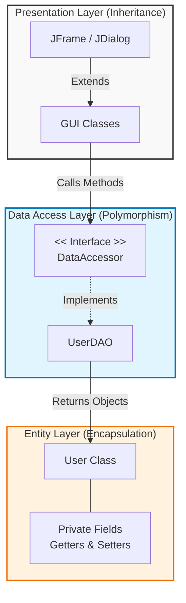

# Java GUI OS Project

A comprehensive desktop application suite built entirely in Java that simulates a complete operating system environment with multiple integrated applications, database connectivity, and real-time functionality.

---

## Slide 2: OOP Implementation (10 Marks)

### Flowchart: OOP Structure




### **Object-Oriented Programming Excellence**

#### ✔ Polymorphism

```java
interface DataAccessor<T> {
    T read(String key) throws SQLException;
    T update(T entity) throws SQLException;
}
```

*Implementation: **`UserDAO implements DataAccessor<User>`*

#### ✔ Inheritance

* All GUI classes extend `JFrame` or `JDialog`
* Custom panels extend `JPanel`

#### ✔ Exception Handling

```java
try {
    DatabaseUtil.transferFunds(sender, recipient, amount);
} catch (SQLException ex) {
    JOptionPane.showMessageDialog(this, "Transaction failed!");
}
```

#### ✔ Encapsulation

```java
class User {
    private String username;
    private String password;
    private double balance;
    // Getters & Setters
}
```

---

##  Slide 3: Collections & Generics (6 Marks)

### **Efficient Data Management**

#### ✔ Collections Framework

```java
private static final Map<String, User> activeUsers = new HashMap<>();
private final List<Double> priceHistory = new ArrayList<>();
private final Map<String, Stock> stocks = new LinkedHashMap<>();
```

#### ✔ Generics Implementation

```java
interface DataAccessor<T> {
    T read(String key) throws SQLException;
    T update(T entity) throws SQLException;
    List<T> findAll() throws SQLException;
}

class UserDAO implements DataAccessor<User>
```

---

##  Slide 4: Multithreading & Synchronization (4 Marks)

### **Concurrent Operations**

#### ✔ Multithreading

```java
new Thread(() -> executeTransfer(recipient, amount)).start();
```

Real-time stock updates:

```java
feedTimer = new javax.swing.Timer(1200, e -> {
    if (!feedRunning) return;
    updatePricesStep();
});
```

#### ✔ Thread Safety

* `SwingUtilities.invokeLater()` for UI updates
* Separate threads for chat system networking
* Timer-based background tasks

---

##  Slide 5: Database Operations Classes (7 Marks)

### **Robust Data Management**

#### ✔ Database Utility Class

```java
class DatabaseUtil {
    // Connection management + Transactions
}
```

#### ✔ DAO Pattern

```java
class UserDAO implements DataAccessor<User> {
    public User create(User user);
    public User read(String username);
    public User update(User user);
    public List<User> findAll();
}
```

#### ✔ Transaction Management

```java
conn.setAutoCommit(false);
// Execute operations
conn.commit();
```

---

##  Slide 6: JDBC Connectivity (3 Marks)

### **Database Integration**

#### ✔ JDBC Setup

```java
public static Connection getConnection() throws SQLException {
    Class.forName("com.mysql.cj.jdbc.Driver");
    return DriverManager.getConnection(DB_URL, DB_USER, DB_PASS);
}
```

#### ✔ Prepared Statements

```java
String sql = "INSERT INTO users (username, password, balance) VALUES (?, ?, ?)";
PreparedStatement stmt = conn.prepareStatement(sql);
```

---

##  Slide 7: Application Showcase – Stock Market

### **Real-time Financial Simulation**

Features:

* Live stock price updates
* Interactive buy/sell actions
* Portfolio tracking
* Real-time graph rendering

Technical Highlights:

* Custom `StockGraphPanel`
* Timer-based updates
* Collections for history storage

---

##  Slide 8: Application Showcase – Digital Payment

### **Secure Transaction System**

* Atomic transactions
* Transaction history
* Real-time balance updates

```java
DatabaseUtil.transferFunds(sender, recipient, amount);
```

---

##  Slide 9: Application Showcase – Chat System

### **Network Communication**

Features:

* Client/Server architecture
* Real-time messaging
* Threaded message handling

Implementation:

* `ServerSocket` & `Socket`
* Background threads
* `SwingWorker`

---

##  Slide 10: Games & Utilities

### **Diverse App Suite**

Games:

* Snake
* Typing Speed Test
* RPG Adventure
* Rock Paper Scissors
* Number Guessing

Utilities:

* Calculator
* Notes App (File I/O)
* String utilities

---

##  Slide 11: Theme Management System

### **Dynamic UI Customization**

```java
enum ColorScheme { DARK, LIGHT, CYBER, OCEAN }
```

* Runtime theme switching
* Font scaling
* Consistent global appearance

---

##  Slide 12: Architecture Overview

### **System Design**

Components:

* Core Framework
* DAO/Data Layer
* Application Layer
* Theme Engine

Patterns Used:

* Singleton
* DAO
* MVC

---

##  Slide 13: Code Quality & Best Practices

### **Professional Standards**

✔ Clean Package Structure ✔ Exception Handling ✔ Documentation & Comments ✔ Modular Code

---

##  Slide 14: Demonstration

### **Live Demo Includes:**

* Login → Dashboard
* Stock Market
* Digital Payments
* Chat Communication
* Games
* Theme Switch

---

##  Slide 15: Conclusion & Future Enhancements

### **Project Summary**

✔ Complete OS-like application suite
✔ Meets all rubric requirements
✔ Scalable, modular, well-designed

### **Future Enhancements**

* Mobile version
* More financial tools
* Cloud sync
* Security improvements

---

## 🙏 Thank You!
